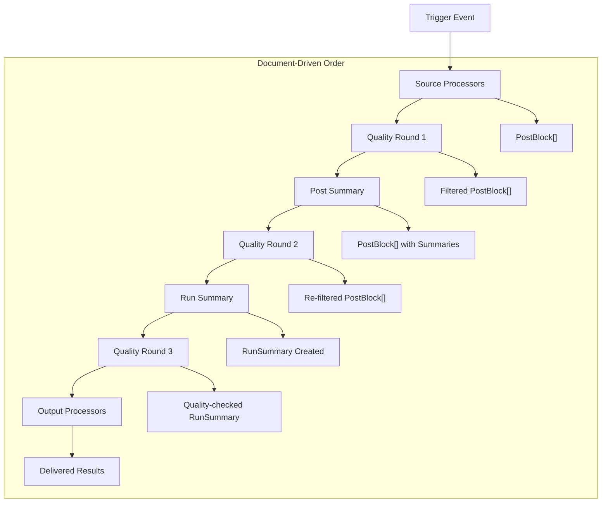

# Flow Runner Execution Logic

## Overview

The Flow Runner is the core orchestration engine that executes Curator Document workflows. It manages the lifecycle of a single Flow execution (Run), coordinating data flow through a **dynamic, document-driven processor pipeline** from trigger to output.

## Architecture

The Flow Runner operates as a **flexible state machine** where the processing order is entirely determined by the Curator Document structure. Unlike traditional fixed pipelines, the runner can handle:

- **Multiple quality rounds** at different stages
- **Quality assessment of summaries** (both post and run summaries)
- **Interleaved processing stages** based on document order
- **Arbitrary processor sequences** as defined in the YAML

The only fixed constraint is that **Triggers** initiate execution and **Sources** must run before any content processing.

## Execution Flow

### Dynamic Processing Model

The Flow Runner executes processors in the **exact order defined by the Curator Document**. The `Flow.OrderOfOperations` field contains a sequence of `ProcessReference` entries that define the execution order.

### Main Loop Pseudocode

```go
func (r *FlowRunner) ExecuteRun(ctx context.Context, flowID string, triggerEvent TriggerEvent) (*Run, error) {
    // 1. Initialize Run
    run := &Run{
        ID:          generateRunID(),
        FlowID:      flowID,
        StartedAt:   time.Now(),
        Status:      RunStatusRunning,
        TriggerType: triggerEvent.Type,
        Blocks:      []*PostBlock{},
        Metadata:    triggerEvent.Metadata,
    }
    
    // 2. Load Flow configuration
    flow, err := r.loadFlow(flowID)
    if err != nil {
        return nil, err
    }
    
    // 3. Execute Source processors first (required)
    blocks, err := r.executeSources(ctx, flow.Sources)
    if err != nil {
        run.Status = RunStatusFailed
        return run, err
    }
    run.Blocks = blocks
    
    // 4. Execute processors in document-defined order
    var runSummary *RunSummary
    for _, processRef := range flow.OrderOfOperations {
        switch processRef.Type {
        case QualityProcessorType:
            blocks, err = r.executeQualityProcessor(ctx, processRef.Quality, blocks)
            if err != nil {
                run.Status = RunStatusFailed
                return run, err
            }
            
        case SummaryProcessorType:
            blocks, err = r.executeSummaryProcessor(ctx, processRef.PostSummary, blocks)
            if err != nil {
                run.Status = RunStatusFailed
                return run, err
            }
            
        case RunSummaryProcessorType:
            runSummary, err = r.executeRunSummaryProcessor(ctx, processRef.RunSummary, blocks)
            if err != nil {
                run.Status = RunStatusFailed
                return run, err
            }
            run.RunSummary = runSummary
            
        case OutputProcessorType:
            err = r.executeOutputProcessor(ctx, processRef.Output, blocks, runSummary)
            if err != nil {
                run.Status = RunStatusFailed
                return run, err
            }
        }
        
        // Update run state after each processor
        r.persistRunState(run)
    }
    
    // 5. Finalize Run
    run.Status = RunStatusCompleted
    run.CompletedAt = &time.Now()
    
    return run, nil
}
```

## Data Flow Model

### Batch Processing Strategy

The Flow Runner processes PostBlocks as **full batches** at each processor, not one-by-one. This design choice provides several benefits:

- **Efficiency**: Reduces overhead from repeated processor initialization
- **Consistency**: All blocks in a batch are processed with the same configuration state
- **Parallelization**: Processors can implement internal parallelization if needed
- **Atomicity**: Each processor completes fully before moving to the next

### Dynamic Flow Example



### Flexible Processing Examples

The system supports various processing patterns based on the Curator Document:

**Example 1: Multiple Quality Rounds**
```yaml
quality:
  - quality_rule: { name: "basic_filter", rule: "score > 10" }
  - llm: { name: "relevance_check" }
post_summary:
  - llm: { name: "summarize" }
quality:
  - llm: { name: "summary_quality_check" }  # Quality check on summaries!
```

**Example 2: Quality on Run Summary**
```yaml
post_summary:
  - llm: { name: "post_summary" }
run_summary:
  - llm: { name: "aggregate_summary" }
quality:
  - quality_rule: { name: "summary_length", rule: "len(run_summary.summary) > 100" }
```

### Block Filtering and State Management

Quality processors can filter blocks by setting `QualityResult.Result = "drop"`. The runner removes dropped blocks before passing to subsequent processors:

```go
func (r *FlowRunner) executeQualityProcessor(ctx context.Context, processor QualityProcessor, blocks []*PostBlock) ([]*PostBlock, error) {
    // Process all blocks
    processedBlocks, err := processor.Evaluate(ctx, blocks)
    if err != nil {
        return nil, err
    }
    
    // Filter out dropped blocks
    var survivingBlocks []*PostBlock
    for _, block := range processedBlocks {
        if block.Quality == nil || block.Quality.Result != "drop" {
            survivingBlocks = append(survivingBlocks, block)
        }
    }
    
    return survivingBlocks, nil
}
```

### Quality Assessment of Summaries

Quality processors can evaluate different content types based on context:

```go
func (r *FlowRunner) executeQualityProcessor(ctx context.Context, processor QualityProcessor, blocks []*PostBlock) ([]*PostBlock, error) {
    // Quality processors can evaluate:
    // 1. Original post content (standard case)
    // 2. Post summaries (if summaries exist)
    // 3. Comments, web blocks, image blocks
    // 4. Any combination based on processor configuration
    
    return processor.Evaluate(ctx, blocks)
}

func (r *FlowRunner) executeRunSummaryQuality(ctx context.Context, processor QualityProcessor, runSummary *RunSummary) (*RunSummary, error) {
    // Special case: Quality assessment of run summaries
    // This would require extending the QualityProcessor interface
    // or creating a specialized RunSummaryQualityProcessor
    
    // For now, this could be handled by wrapping the RunSummary
    // in a temporary PostBlock for evaluation
    tempBlock := &PostBlock{
        Content: runSummary.Summary,
        // ... other fields as needed
    }
    
    result, err := processor.Evaluate(ctx, []*PostBlock{tempBlock})
    if err != nil {
        return nil, err
    }
    
    if len(result) == 0 || result[0].Quality.Result == "drop" {
        return nil, fmt.Errorf("run summary failed quality check")
    }
    
    return runSummary, nil
}
```

## Synchronization Mechanisms

### Document-Driven Synchronization

The runner executes processors in the exact order specified in the Curator Document. This provides natural synchronization:

1. **Sequential Execution**: Each processor completes before the next begins
2. **State Consistency**: All blocks are at the same processing stage when passed to each processor
3. **Flexible Dependencies**: RunSummary processors can appear anywhere in the sequence, operating on the current state of blocks

### RunSummary Timing

RunSummary processors can appear at any point in the processing sequence:

- **Early RunSummary**: Operates on raw or partially processed blocks
- **Mid-process RunSummary**: Creates intermediate aggregations
- **Final RunSummary**: Traditional end-of-pipeline summary

```yaml
# Example: Multiple run summaries at different stages
sources:
  - reddit: { subreddits: ["MachineLearning"] }
run_summary:
  - llm: { name: "raw_overview" }  # Summary of raw posts
quality:
  - quality_rule: { name: "filter" }
run_summary:
  - llm: { name: "filtered_overview" }  # Summary after filtering
post_summary:
  - llm: { name: "enhance" }
run_summary:
  - llm: { name: "final_digest" }  # Final comprehensive summary
```

### Concurrent Processing Within Processors

While processors execute sequentially, individual processors can implement internal concurrency:

```go
// Example: A processor that processes blocks concurrently
func (p *MyProcessor) Evaluate(ctx context.Context, blocks []*PostBlock) ([]*PostBlock, error) {
    var wg sync.WaitGroup
    results := make([]*PostBlock, len(blocks))
    
    for i, block := range blocks {
        wg.Add(1)
        go func(idx int, b *PostBlock) {
            defer wg.Done()
            // Process block concurrently
            results[idx] = p.processBlock(ctx, b)
        }(i, block)
    }
    
    wg.Wait()
    return results, nil
}
```

### Order of Operations Construction

The `Flow.OrderOfOperations` is built during document parsing by preserving the YAML section order:

```go
func (parser *DocumentParser) buildOrderOfOperations(doc *CuratorDocument) []ProcessReference {
    var order []ProcessReference
    
    // The order is determined by the YAML structure:
    // 1. Sources (always first, not in OrderOfOperations)
    // 2. Then sections appear in document order: quality, post_summary, run_summary, output
    // 3. Within each section, processors appear in array order
    
    // Parse each section in document order
    for _, qualityConfig := range doc.Workflow.Quality {
        order = append(order, ProcessReference{
            Type: QualityProcessorType,
            // ... processor reference
        })
    }
    
    for _, summaryConfig := range doc.Workflow.PostSummary {
        order = append(order, ProcessReference{
            Type: SummaryProcessorType,
            // ... processor reference
        })
    }
    
    // ... and so on for run_summary, output
    
    return order
}
```

## Error Handling

### Error Propagation Strategy

- **Processor Errors**: Individual processor failures fail the entire run
- **Block Errors**: Errors on individual blocks are recorded but don't fail the run
- **Retry Logic**: Processors can implement internal retry logic
- **Circuit Breaking**: Future enhancement for external service failures

### Error Recording

```go
func (r *FlowRunner) recordBlockError(block *PostBlock, processorName, stage, errorMsg string) {
    block.Errors = append(block.Errors, ProcessError{
        ProcessorName: processorName,
        Stage:         stage,
        Error:         errorMsg,
        OccurredAt:    time.Now(),
    })
}
```

## Context and Cancellation

The runner supports graceful cancellation through Go's context system:

- **Context Propagation**: All processor calls receive the run context
- **Timeout Handling**: Individual processors can implement timeouts
- **Graceful Shutdown**: Context cancellation stops processing at stage boundaries

```go
func (r *FlowRunner) executeWithTimeout(ctx context.Context, timeout time.Duration, fn func(context.Context) error) error {
    ctx, cancel := context.WithTimeout(ctx, timeout)
    defer cancel()
    
    return fn(ctx)
}
```

## State Management

### Run Persistence

The runner persists run state at key checkpoints:

1. **Run Creation**: Initial run record with pending status
2. **Stage Completion**: Update blocks and status after each stage
3. **Run Completion**: Final status and completion timestamp
4. **Error States**: Immediate persistence of error conditions

### Block State Tracking

Each PostBlock maintains processing state:

- `ProcessedAt`: Timestamp of last processing
- `Quality`: Results from quality assessment
- `Summary`: Results from summarization
- `Errors`: Accumulated processing errors

## Performance Considerations

### Memory Management

- **Streaming**: Large block sets could be processed in chunks (future enhancement)
- **Cleanup**: Temporary data cleared after each stage
- **Limits**: Configurable limits on block count and size

### Monitoring

The runner emits metrics for:

- Run duration by stage
- Block processing rates
- Error rates by processor type
- Memory usage patterns

## Implementation Notes

### Enhanced Processor Interface Design

The dynamic execution model requires some interface enhancements to support flexible processing:

```go
// Base interface remains the same
type Processor interface {
    Name() string
    Configure(config map[string]interface{}) error
    Validate() error
}

// Enhanced interfaces for flexible processing
type QualityProcessor interface {
    Processor
    // Evaluate can assess any content: posts, summaries, comments, etc.
    Evaluate(ctx context.Context, blocks []*PostBlock) ([]*PostBlock, error)
    // CanEvaluate indicates what content types this processor can assess
    CanEvaluate() []string // e.g., ["post", "summary", "comment"]
}

type SummaryProcessor interface {
    Processor
    // Summarize can work on posts at any stage of processing
    Summarize(ctx context.Context, blocks []*PostBlock) ([]*PostBlock, error)
    // Context indicates what this processor summarizes
    Context() string // "post", "comment", "web", etc.
}

type RunSummaryProcessor interface {
    Processor
    // SummarizeRun can be called at any point in the pipeline
    SummarizeRun(ctx context.Context, blocks []*PostBlock) (*RunSummary, error)
    // RequiredFields indicates what block fields this processor needs
    RequiredFields() []string // e.g., ["summary", "quality"]
}
```

### Processor Context Awareness

Processors need to be aware of the current processing context:

```go
type ProcessingContext struct {
    Stage          string    // "early", "mid", "final"
    PreviousStages []string  // What processing has already occurred
    AvailableData  []string  // What data fields are populated
}

type ContextAwareProcessor interface {
    Processor
    SetContext(ctx ProcessingContext) error
}
```

### Configuration Loading

Processors are configured during Flow initialization:

```go
func (r *FlowRunner) configureProcessor(processor Processor, config map[string]interface{}) error {
    if err := processor.Configure(config); err != nil {
        return fmt.Errorf("failed to configure processor %s: %w", processor.Name(), err)
    }
    
    if err := processor.Validate(); err != nil {
        return fmt.Errorf("invalid configuration for processor %s: %w", processor.Name(), err)
    }
    
    return nil
}
```

## Future Enhancements

### Parallel Stage Execution

Future versions could support parallel execution of independent processors within a stage:

```go
// Execute quality processors in parallel if they don't depend on each other
func (r *FlowRunner) executeQualityProcessorsParallel(ctx context.Context, processors []QualityProcessor, blocks []*PostBlock) ([]*PostBlock, error) {
    // Implementation would use goroutines and channels
    // to coordinate parallel processor execution
}
```

### Streaming Processing

For very large datasets, implement streaming:

```go
type StreamingProcessor interface {
    ProcessStream(ctx context.Context, input <-chan *PostBlock, output chan<- *PostBlock) error
}
```

### Checkpoint Recovery

Add ability to resume failed runs from checkpoints:

```go
type CheckpointManager interface {
    SaveCheckpoint(runID string, stage string, blocks []*PostBlock) error
    LoadCheckpoint(runID string) (*Checkpoint, error)
}
```

This execution model provides a robust, scalable foundation for the Curator AI processing pipeline while maintaining simplicity and debuggability.