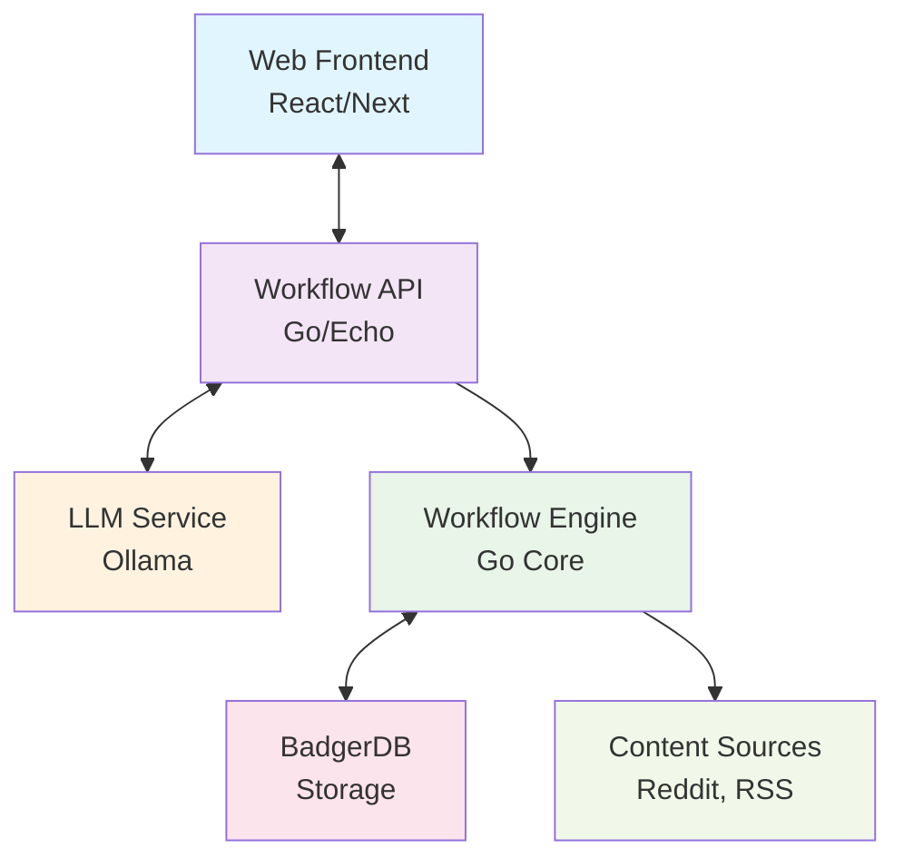
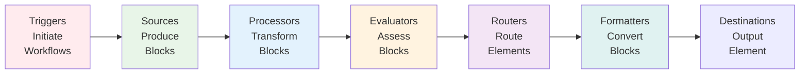

# Curator MVP Technical Document

## 1. Executive Summary

Curator is a personal intelligence platform that transforms scattered information into structured intelligence through AI-powered content curation. The MVP focuses on building a flexible, configurable workflow engine based on a **Block architecture** that enables generic, composable processing components.

**Key MVP Goals:**
- Build a modular workflow engine with Block-based data abstraction
- Implement AI-powered quality assessment and filtering
- Provide comprehensive feedback mechanisms for pipeline optimization
- Enable self-hosted deployment with local LLM integration
- Deliver structured intelligence in both human and AI-readable formats

Rather than processors needing to understand arbitrary schemas from upstream components, the system uses typed **Block** abstractions (TextBlock, ImageBlock, BinaryBlock, etc.) that contain standardized operable content plus metadata. This enables truly generic processors that can work with any upstream component producing compatible Block types.

## 2. System Architecture

### 2.1 High-Level Architecture


### 2.3 Component Architecture



#### Component Hierarchy
1. **Triggers**: Initiate workflow execution based on schedules, events, or requests
2. **Sources**: Generate Elements with initial Blocks from external systems
3. **Processors**: Transform Blocks, create new Blocks, preserve metadata
4. **Evaluators**: Specialized processors that assess and score Block content
5. **Routers**: Flow control based on Element/Block properties and scores
6. **Formatters**: Convert between block types
7. **Destinations**: Output the data somewhere

### 2.4 Data Flow Example: Document Translation

```
Element-001 Flow:

Stage 1: Document Source
├── DocumentBlock (PDF document)

Stage 3: OCR Processor
└── TextBlock (extracted text)

Stage 4: Translation Processor
└── TextBlock (translated text)

Stage 5: Text to Formatter
└── DocumentBlock (translated PDF)
```

## 3. Core System Components

### 3.1 Trigger System Architecture

#### Trigger Types & Use Cases

**CronTrigger**: Time-based workflow execution
- Daily intelligence digests
- Weekly analysis reports  
- Periodic content archive processing
- Scheduled benchmark runs

**APITrigger**: On-demand processing via HTTP endpoints
- Real-time document translation requests
- Interactive content analysis
- User-initiated workflow execution
- Integration with external applications

#### Trigger Configuration Model
```yaml
workflow:
  name: "Multi-Trigger Document Analysis"
  
  triggers:
    # Scheduled processing
    - type: cron
      schedule: "0 6 * * *"
      description: "Daily batch processing"
      
    # On-demand API
    - type: api_endpoint
      path: "/analyze/document"
      method: POST
      auth: bearer_token
      rate_limit: "100/hour"
```

### 3.2 Block System Architecture

The system is built around **typed Block abstractions** that solve the modularity problem:

#### Core Block Types
- **TextBlock**: Contains `strings[]` as primary operable content + metadata (coordinates, language, confidence)
- **ObjectBlock**: Contains an arbitrary object + JSON schema as the primary operable content. 
- **ImageBlock**: Contains image data as primary operable content + metadata (dimensions, format, etc.)
- **BinaryBlock**: Contains binary data as primary operable content + metadata (size, format, etc.)
- **AudioBlock**: Contains audio data as primary operable content + metadata (duration, format, etc.)
- **DocumentBlock**: Contains documents like PDF, Word Document or structured text

#### Block Processing Model
1. **Elements flow through pipelines** - Each Element accumulates Blocks without destroying previous ones
2. **Processors declare Block type compatibility** - e.g., "I operate on TextBlock → produces TextBlock"
3. **Operable content abstraction** - Processors work on standardized content (strings, image data, etc.)
4. **Metadata preservation** - Rich metadata flows through unchanged when not operated on
5. **Processing lineage** - Complete history preserved in accumulated Blocks


#### Element Structure
```
Element {
    ID: string
    SourceType: string  
    Blocks: []Block
    ProcessingLog: []ProcessingStep
    CurrentOperable: BlockID  // Points to current processing target
}
```

#### Block Interface
```
Block {
    Type: BlockType  // TEXT, IMAGE, BINARY, AUDIO, DOCUMENT
    OperableContent: interface{}  // Type-specific primary content
    Metadata: map[string]interface{}  // Preserved auxiliary data
    ProcessorID: string  // Which processor created this Block
    CreatedAt: timestamp
}
```

### 3.3 Processor Type System

#### Processor Declaration Model
Every processor declares its Block type compatibility:

```yaml
processor_types:
  translation:
    operates_on: [TextBlock]
    produces: [TextBlock]
    preserves_metadata: true
    
  ocr_extractor:
    operates_on: [ImageBlock]
    produces: [TextBlock, ImageBlock]
    metadata_mapping:
      coordinates: "from_ocr_analysis"
      
  quality_evaluator:
    operates_on: [TextBlock]
    produces: [TextBlock]  # Same block with added scores
    adds_scores: [substantiveness, constructiveness, novelty]
```

#### Generic Processing Benefits
- **No Schema Coupling**: Translation processor only needs TextBlock.strings[], not OCR internals
- **Universal Compatibility**: Any processor producing TextBlocks can feed translation
- **Metadata Preservation**: Coordinates, timestamps, etc. flow through automatically
- **Type Safety**: Runtime validation ensures Block type compatibility

### 3.4 Workflow Configuration System

#### Declarative Workflow Model
```yaml
workflow:
  name: "Localllama Daily Digest"

  stages:
    redditSrc:              # ── node ID
      type: source
      dataID: post
      use: reddit_source
      produces: [ObjectBlock]
      config:
        subreddit: "localllama"
        include_comments: true
      next:
        - agg
        - urlRoute
        - imgRoute     # multiple targets = simple fan-out

    urlRoute:
      type: router
      operates_on: [ObjectBlock]
      routes:         # ordered routing table
        - when: "contains_urls == true"
          extract: "external_urls"
          to: urlFetch
        - else: drop  # built-in sink

    imgRoute:
      type: router
      operates_on: [TextBlock]
      routes:
        - when: "has_image_urls == true"
          extract: "image_urls"
          to: imgSum        # imgSum will fetch then summarize images
        - else: drop

    webFetch:
      type: processor
      dataID: web_summaries
      use: web_fetcher
      config:
        readability: true
      produces: [TextBlock]
      next: [agg]

    webSum:
      type: processor
      use: summariser
      operates_on: [TextBlock]
      prompt_template: "./templates/websum.tmpl"

    imgFetch:
      type:processor
      use: url_fetcher
      operates_on: [TextBlock]
      produces: [ImageBlock]
      next: [imgSum]

    imgSum:
      type: processor
      dataID: image_summaries
      use: image_summarizer
      produces: [TextBlock]
      next: [agg]     # converging edge

    agg: # ── join node; receives multiple inbound edges
      type: processor
      use: thread_aggregator
      operates_on: [ObjectBlock, TextBlock]
      produces: [ObjectBlock]
      config:
        template: "reddit_digest_prompt"
      selector_map:
        post_text: 'post.body'
        comment_texts: 'comment'
        web_summaries: web_summaries
        image_summaries: image_summaries
          
    threadSum:
      type: processor
      use: summariser
      operates_on: [ObjectBlock]
      produces: [ObjectBlock] # By signalling an ObjectBlock, we tell the processor to expect JSON to be returned
      prompt_template: "./templates/threadsum.tmpl"
      schema: "./schemas/threadschema.json"
      next: [batchJoin]

    batchJoin: # Wait until everything from reddit source has entered the batch join
      type: batch_join
      sources: redditSrc
      produces: [ObjectBlock]
      max_wait_sec: 60
      next: [emailFmt]

    emailFmt:
      type: formatter
      use: email_formatter
      operates_on: [ObjectBlock]
      produces: [TextBlock]
      template: "./email_templates/email.tmpl"
      next: [email]

    email:
      type: destination
      use: smtp_email
      operates_on: [TextBlock]
      config:
        to: ["digest@example.com"]
        subject: "Localllama Daily Digest"
```

### 3.5 LLM Integration Layer

#### Model Abstraction
- **OpenAI-Compatible Interface**: Standardized API supporting multiple providers
- **Local Model Support**: Ollama integration for privacy-first processing  
- **Per-Component Configuration**: Different models for different processor types
- **Block-Aware Prompting**: Prompts designed for Block content types

#### Quality Assessment Framework
LLM Evaluators assess Block content across dimensions:
- **Substantiveness**: Evidence vs opinion depth in TextBlock.strings
- **Constructiveness**: Discourse contribution vs inflammatory content
- **Novelty**: New insights vs common point rehashing  
- **Accuracy**: Factual correctness and logical consistency
- **Relevance**: Alignment with workflow objectives

## 4. Quality Measurement & Feedback System

### 4.1 Multi-Layered Evaluation Framework

#### Automated Benchmarking
- **Block Type Benchmarks**: Golden datasets for each Block type processing
- **Cross-Model Validation**: Compare LLM performance across model sizes
- **Processing Consistency**: Multiple runs on identical Block content
- **Component Isolation Testing**: Individual processor performance measurement

#### User Feedback Integration
- **Block-Level Ratings**: Users rate quality of individual Block transformations
- **Pipeline Effectiveness**: End-to-end workflow quality assessment
- **Correction Interface**: Override processing decisions with explanations
- **Preference Learning**: Adapt to user-specific quality definitions

#### Component Performance Analytics
- **Block Transformation Quality**: Precision/recall per processor type
- **Processing Latency**: Time analysis per Block type and processor
- **Resource Utilization**: Cost per Block transformation
- **Error Pattern Analysis**: Failed processing categorization and trends

### 4.2 Block-Specific Evaluation

#### Processor-Agnostic Benchmarking
- **TextBlock Quality**: Translation accuracy, summarization coherence
- **ImageBlock Processing**: OCR accuracy, image enhancement quality
- **Cross-Block Consistency**: Coordinate preservation, metadata integrity
- **Pipeline Composition**: End-to-end Block flow optimization

## 5. Technology Stack

### 5.1 Backend Architecture (Go)
- **Framework**: Echo HTTP framework for API layer
- **Storage**: BadgerDB for Element/Block persistence
- **Type System**: Block interface implementations with validation
- **LLM Integration**: OpenAI-compatible client with model abstraction
- **Processing Engine**: Concurrent Block processing with dependency resolution

### 5.2 Frontend (TypeScript/React)
- **Framework**: Next.js for workflow management interface
- **Styling**: TailwindCSS for component design system
- **Type Safety**: Generated types from Block schema definitions
- **Real-time Updates**: WebSocket integration for pipeline monitoring

### 5.3 Deployment Infrastructure
- **Containerization**: Docker with multi-stage builds
- **Orchestration**: Docker Compose for unified deployment
- **LLM Backend**: Ollama integration for local model serving
- **Monitoring**: Built-in Block processing metrics and health checks

## 6. Development Plan

### 6.1 MVP Iterations

#### Iteration 1: Trigger System & Block Foundation (Weeks 1-2)
- **Backend**: Implement Trigger system with Cron and API endpoint support
- **Backend**: Block type system and Element structure
- **Backend**: Basic Sources (Reddit, RSS) producing TextBlocks
- **Backend**: Simple Processors (text extraction, filtering) with Block compatibility
- **Integration**: Trigger activation and Block validation infrastructure

#### Iteration 2: Advanced Triggers & LLM Integration (Weeks 3-4)
- **Backend**: Webhook and File trigger implementations
- **Backend**: Evaluator components with Block-aware LLM prompting
- **Backend**: Router implementation for Block/Element flow control
- **Backend**: Error handling and Block processing retry logic
- **Testing**: Multi-trigger workflow validation and Block transformation benchmarking

#### Iteration 3: Advanced Components & UI (Weeks 5-6)
- **Backend**: Aggregator and Formatter components
- **Frontend**: Block-aware workflow configuration interface
- **Frontend**: Real-time Block processing visualization
- **Integration**: End-to-end Element/Block flow monitoring

#### Iteration 4: Multi-Block Workflows & Analytics (Weeks 7-8)
- **Backend**: ImageBlock, BinaryBlock, DocumentBlock implementations
- **Backend**: Complex multi-Block processors (OCR, translation)
- **Frontend**: Block-level performance analytics dashboard
- **Testing**: Cross-Block workflow validation and optimization

### 6.2 Success Criteria

#### Block System Validation
- **Type Safety**: 100% Block compatibility validation before processing
- **Processing Reliability**: <5% failure rate in Block transformations
- **Metadata Preservation**: 100% metadata integrity across processor chains
- **Component Modularity**: Any TextBlock producer can feed any TextBlock consumer

#### Quality Metrics
- **Processor Accuracy**: >85% precision on Block transformation benchmarks
- **User Satisfaction**: >4.0/5.0 rating on Block processing quality
- **System Performance**: Process 1000+ Blocks/hour on modest hardware

## 7. Risk Mitigation

### 7.1 Block Architecture Risks

| Risk | Impact | Mitigation |
|------|--------|-----------|
| **Block Type Proliferation** | Complex type management | Standardized Block interfaces, careful type design |
| **Metadata Bloat** | Performance degradation | Configurable metadata retention policies |
| **Processor Compatibility** | Breaking changes | Semantic versioning, compatibility testing |
| **Cross-Block Dependencies** | Complex error handling | Clear dependency declaration, graceful degradation |

### 7.2 Technical Implementation Risks

| Risk | Impact | Mitigation |
|------|--------|-----------|
| **LLM Quality Variance** | Inconsistent Block processing | Multi-model evaluation, fallback strategies |
| **Processing Performance** | Poor user experience | Concurrent Block processing, caching strategies |
| **Configuration Complexity** | Low adoption | Visual Block flow builder, template marketplace |

## 8. Future Extensibility

### 8.1 Block System Evolution
- **Custom Block Types**: User-defined Block structures for specialized domains
- **Block Composition**: Nested and hierarchical Block relationships
- **Stream Processing**: Real-time Block processing for live data sources
- **Distributed Blocks**: Multi-node Block processing and synchronization

### 8.2 Advanced Capabilities
- **Block Marketplace**: Community-contributed processors and Block types
- **Federated Workflows**: Cross-instance Block sharing and processing
- **Advanced Analytics**: Machine learning on Block transformation patterns
- **Enterprise Integration**: Advanced Block governance and compliance features

---

This Block-based architecture provides the systematic foundation for building Curator's flexible workflow engine while ensuring true component modularity and extensibility.
