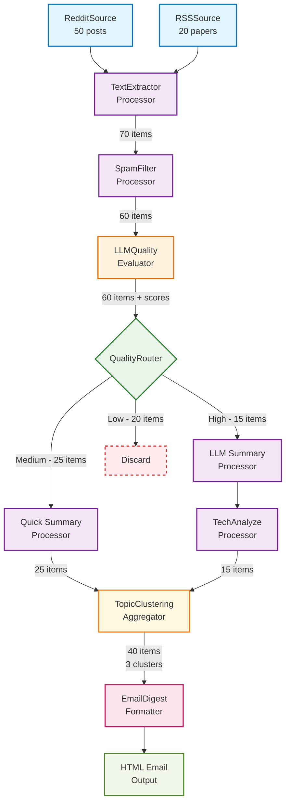

# Curator Workflow System - Conceptual Framework

## Core Terminology

### Workflow vs Pipeline
- **Workflow**: The complete end-to-end process from content discovery to delivery (user-facing concept)
- **Pipeline**: The technical execution engine that processes content through stages (system concept)
- **Component**: The element that produces or acts upon data, making up the pipeline
- A single workflow may contain multiple pipelines or processing paths

### Key Components

#### 1. **Sources** (Data Ingestion & Normalization)
- **Definition**: Complete interfaces to external content systems that output normalized data
- **Responsibility**: 
  - Handle authentication, rate limiting, pagination, error handling
  - Auto-discover and attach JSON schemas describing their data structure
  - Output uniform ContentItem objects ready for processing
- **Examples**: RedditSource, RSSSource, TwitterSource, ForumScraperSource
- **Configuration**: Source-specific settings (subreddits, keywords, update frequency)
- **Interface**: Each source implements a standard `Fetch() []ContentItem` method

#### 2. **Processors** (Transformation Layer)
- **Definition**: Discrete units that transform, analyze, or enrich content
- **Types**:
  - **Extractors**: Parse text, extract entities, clean formatting
  - **Filters**: Rule-based quality checks, spam detection, keyword matching
  - **Enrichers**: Add metadata, resolve links, fetch additional context
  - **Analyzers**: LLM-powered quality scoring, summarization, classification
- **Characteristics**: Stateless, composable, dependency-aware

#### 3. **Evaluators** (Quality Assessment)
- **Definition**: Specialized processors that assign quality scores and provide data that can be used for routing decisions
- **Dimensions**: Substantiveness, constructiveness, novelty, accuracy, relevance
- **Outputs**: Numerical scores, confidence levels, reasoning explanations
- **Models**: Support multiple LLM backends (local Ollama, OpenAI API, etc.)

#### 4. **Routers** (Flow Control)
- **Definition**: Components that direct content through different processing paths based on criteria
- **Logic**: If/then rules, score thresholds, content type detection
- **Examples**: "High-quality content → summarization path", "Low-quality → discard path"

#### 5. **Aggregators** (Collection & Grouping)
- **Definition**: Components that collect processed content for output generation
- **Functions**: Deduplication, topic clustering, priority ranking
- **Outputs**: Structured collections ready for formatting

#### 6. **Formatters** (Output Generation)
- **Definition**: Transform aggregated content into deliverable formats
- **Types**: Email digest, JSON feed, knowledge graph, dashboard data
- **Templates**: User-customizable output formatting

## Example Workflow: AI Research Daily Digest




This workflow demonstrates:
- **Sources**: Complete platform integrations
- **Processors**: Stateless transformations (extract, filter, summarize)
- **Evaluators**: Decision-making components (quality scoring)
- **Routers**: Flow control based on criteria
- **Aggregators**: Collection and organization
- **Formatters**: Output generation

## Content Object Structure

Every piece of content flowing through the system carries:

```go
type ContentItem struct {
    // Core identification
    ID          string                 `json:"id"`
    SourceType  string                 `json:"source_type"`  // "reddit", "rss", etc.
    SourceID    string                 `json:"source_id"`    // Original source identifier
    
    // Raw data with schema
    RawData     map[string]interface{} `json:"raw_data"`
    Schema      *JSONSchema            `json:"schema"`
    
    // Processing metadata
    ProcessedAt time.Time              `json:"processed_at"`
    Pipeline    string                 `json:"pipeline"`     // Which workflow processed this
    
    // Analysis results
    Scores      map[string]float64     `json:"scores"`       // Quality dimensions
    Tags        []string               `json:"tags"`         // Classification labels
    Summary     string                 `json:"summary"`      // LLM-generated summary
    
    // Processing trail
    ProcessingLog []ProcessingStep     `json:"processing_log"`
    Errors        []ProcessingError    `json:"errors"`
}
```

## Workflow Configuration Model

Workflows are defined declaratively:

```yaml
workflow:
  name: "AI Research Digest"
  schedule: "0 6 * * *"  # Daily at 6 AM
  
  sources:
    - type: reddit
      config:
        subreddits: ["MachineLearning", "artificial", "LocalLLaMA"]
        limit: 100
    - type: rss
      config:
        urls: ["https://arxiv.org/rss/cs.AI", "https://distill.pub/rss.xml"]
  
  pipeline:
    - processor: extract_text
    - processor: spam_filter
      config:
        min_length: 50
    - processor: llm_quality_score
      config:
        model: "ollama/llama2-7b"
        dimensions: ["substantiveness", "novelty"]
    - router:
        conditions:
          - if: "scores.substantiveness > 7"
            then: "high_quality_path"
          - else: "discard"
    
  paths:
    high_quality_path:
      - processor: llm_summarize
      - aggregator: topic_cluster
      - formatter: email_digest
```

## Processing Execution Model

### 1. **Batch Processing**
- Workflows run on cron schedules
- Process all new content since last successful run
- Maintain processing state between runs

### 2. **Dependency Resolution**
- Processors declare input requirements
- System validates dependencies before execution
- Parallel execution of independent processors

### 3. **Error Handling**
- Failed processors skip items, pipeline continues
- Automatic retries for transient failures (LLM timeouts)
- Comprehensive error logging for debugging

### 4. **State Management**
- Track processing checkpoints
- Support for reprocessing failed items
- Incremental updates for large content volumes

## Configuration & Management

### 1. **Schema-Driven Configuration**
- JSON Schema validates workflow definitions
- TypeScript types generated for frontend
- Runtime validation in Go backend

### 2. **Hot Reloading**
- Configuration changes apply to next scheduled run
- No service restart required
- Validation prevents broken configurations

### 3. **Monitoring & Observability**
- Real-time processing status
- Performance metrics per processor
- Content flow visualization
- Error tracking and alerting

## Extension Points

### 1. **Custom Processors**
- Plugin architecture for user-defined logic
- Standard interface for processor development
- Language-agnostic via HTTP/gRPC APIs

### 2. **Model Integration**
- Pluggable LLM backends
- Model-specific prompt templates
- Performance benchmarking across models

### 3. **Output Formats**
- Template-based formatting system
- Custom formatter plugins
- Multi-format output from single workflow

This framework provides the conceptual foundation for building flexible, maintainable workflows while keeping the system understandable and debuggable.