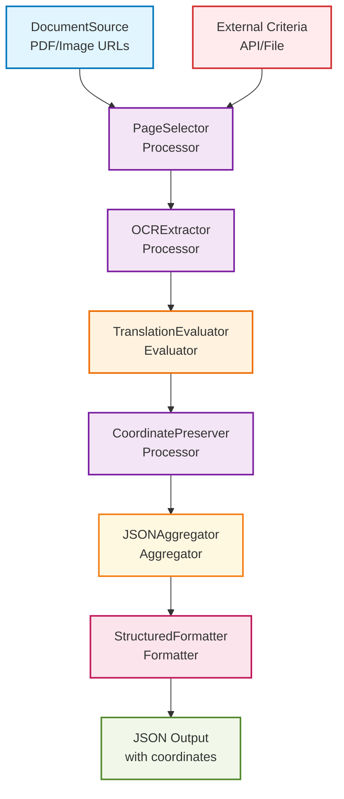

# Document OCR Translation Workflow Example

## Workflow Overview

This workflow demonstrates how Curator's component system can handle complex document processing that goes beyond typical content curation.



## Component Breakdown

### 1. DocumentSource (Source)
```yaml
sources:
  - type: document
    config:
      urls: 
        - "https://example.com/reports/*.pdf"
        - "file:///path/to/documents/"
      formats: ["pdf", "png", "jpg", "tiff"]
      polling_interval: "1h"
```

**Schema Discovery Output:**
```json
{
  "type": "object",
  "properties": {
    "id": {"type": "string"},
    "url": {"type": "string", "format": "uri"},
    "filename": {"type": "string"},
    "format": {"type": "string", "enum": ["pdf", "png", "jpg", "tiff"]},
    "page_count": {"type": "integer"},
    "file_size": {"type": "integer"},
    "downloaded_at": {"type": "string", "format": "date-time"},
    "raw_binary": {"type": "string", "contentEncoding": "base64"}
  }
}
```

### 2. PageSelector (Processor)
```yaml
pipeline:
  - processor: page_selector
    config:
      criteria_source: "external_api"  # or "file", "static"
      api_endpoint: "https://criteria-service.com/select-page"
      fallback_page: 1
```

**Implementation:**
```go
type PageSelectorProcessor struct {
    CriteriaSource string `json:"criteria_source"`
    APIEndpoint    string `json:"api_endpoint,omitempty"`
    FallbackPage   int    `json:"fallback_page"`
}

func (p *PageSelectorProcessor) Process(item *ContentItem) error {
    // Extract external criteria
    criteria, err := p.fetchCriteria(item)
    if err != nil {
        criteria = p.FallbackPage
    }
    
    // Select specific page based on criteria
    selectedPage := p.selectPage(item, criteria)
    
    // Update ContentItem with selected page
    item.RawData["selected_page"] = selectedPage
    item.RawData["selection_criteria"] = criteria
    
    return nil
}
```

### 3. OCRExtractor (Processor)
```yaml
pipeline:
  - processor: ocr_extractor
    config:
      engine: "tesseract"  # or "paddle", "easyocr"
      preserve_coordinates: true
      languages: ["eng", "spa", "fra"]
      confidence_threshold: 0.7
```

**OCR Output Structure:**
```go
type OCRResult struct {
    Text        string            `json:"text"`
    Confidence  float64           `json:"confidence"`
    BoundingBox BoundingBox       `json:"bounding_box"`
    Language    string            `json:"language"`
}

type BoundingBox struct {
    X      float64 `json:"x"`
    Y      float64 `json:"y"`
    Width  float64 `json:"width"`
    Height float64 `json:"height"`
}
```

**Updated ContentItem:**
```json
{
  "id": "doc_001",
  "source_type": "document",
  "raw_data": {
    "filename": "report.pdf",
    "selected_page": 3,
    "ocr_results": [
      {
        "text": "Financial Summary",
        "confidence": 0.95,
        "bounding_box": {"x": 100, "y": 50, "width": 200, "height": 30},
        "language": "eng"
      },
      {
        "text": "Revenue increased by 15%",
        "confidence": 0.89,
        "bounding_box": {"x": 100, "y": 100, "width": 300, "height": 20},
        "language": "eng"
      }
    ]
  }
}
```

### 4. TranslationEvaluator (Evaluator)
```yaml
pipeline:
  - processor: translation_evaluator
    config:
      model: "ollama/aya-23-8b"  # Multilingual model
      target_language: "spanish"
      preserve_structure: true
      confidence_scoring: true
```

**Translation Processing:**
```go
func (e *TranslationEvaluator) Process(item *ContentItem) error {
    ocrResults := item.RawData["ocr_results"].([]OCRResult)
    
    for i, result := range ocrResults {
        prompt := fmt.Sprintf(`
Translate the following text to %s while preserving any technical terms and formatting:

Text: "%s"
Original Language: %s

Return only the translated text, no explanation.
`, e.TargetLanguage, result.Text, result.Language)

        translation, confidence := e.callLLM(prompt)
        
        // Add translation while preserving coordinates
        ocrResults[i].TranslatedText = translation
        ocrResults[i].TranslationConfidence = confidence
    }
    
    // Score overall translation quality
    item.Scores["translation_quality"] = e.calculateOverallQuality(ocrResults)
    item.Scores["translation_confidence"] = e.calculateOverallConfidence(ocrResults)
    
    return nil
}
```

### 5. CoordinatePreserver (Processor)
```yaml
pipeline:
  - processor: coordinate_preserver
    config:
      merge_adjacent: true
      coordinate_precision: 2
      maintain_reading_order: true
```

**Coordinate Processing:**
```go
func (p *CoordinatePreserver) Process(item *ContentItem) error {
    ocrResults := item.RawData["ocr_results"].([]OCRResult)
    
    // Create structured output preserving spatial relationships
    preservedData := map[string]interface{}{
        "page_dimensions": item.RawData["page_dimensions"],
        "reading_order": p.calculateReadingOrder(ocrResults),
        "text_blocks": p.groupByProximity(ocrResults),
        "spatial_index": p.createSpatialIndex(ocrResults),
    }
    
    item.RawData["preserved_structure"] = preservedData
    return nil
}
```

### 6. JSONAggregator (Aggregator)
```yaml
pipeline:
  - aggregator: json_aggregator
    config:
      group_by: "document"
      include_metadata: true
      coordinate_format: "normalized"  # or "absolute"
```

### 7. StructuredFormatter (Formatter)
```yaml
pipeline:
  - formatter: structured_formatter
    config:
      output_format: "json"
      include_confidence: true
      coordinate_system: "pdf_points"
      template: "translation_with_coordinates"
```

## Complete Workflow Configuration

```yaml
workflow:
  name: "Document Translation with Coordinates"
  schedule: "0 */4 * * *"  # Every 4 hours
  
  sources:
    - type: document
      config:
        urls: ["https://reports.company.com/daily/*.pdf"]
        formats: ["pdf"]
        max_file_size: "50MB"
  
  pipeline:
    # Page Selection
    - processor: page_selector
      config:
        criteria_source: "external_api"
        api_endpoint: "https://criteria.internal.com/select-page"
        criteria_params:
          document_type: "financial_report"
          target_section: "summary"
        fallback_page: 1
    
    # OCR Processing
    - processor: ocr_extractor
      config:
        engine: "tesseract"
        preserve_coordinates: true
        languages: ["eng"]
        dpi: 300
        confidence_threshold: 0.7
    
    # Translation
    - processor: translation_evaluator
      config:
        model: "ollama/aya-23-8b"
        target_language: "spanish"
        preserve_formatting: true
        batch_size: 10
    
    # Structure Preservation
    - processor: coordinate_preserver
      config:
        merge_adjacent: true
        reading_order: "left_to_right_top_to_bottom"
        coordinate_precision: 2
    
    # Quality Check Router
    - router:
        conditions:
          - if: "scores.translation_confidence > 0.8"
            then: "high_quality_path"
          - if: "scores.translation_confidence > 0.6"
            then: "medium_quality_path"
          - else: "review_path"
  
  paths:
    high_quality_path:
      - aggregator: json_aggregator
        config:
          group_by: "document"
          include_metadata: true
      - formatter: structured_formatter
        config:
          template: "final_translation_json"
          output_file: "/output/translations/{{.filename}}_translated.json"
    
    medium_quality_path:
      - processor: confidence_booster
        config:
          model: "ollama/llama3.1-70b"  # Use larger model for review
      - aggregator: json_aggregator
      - formatter: structured_formatter
    
    review_path:
      - formatter: review_formatter
        config:
          template: "manual_review_needed"
          output_file: "/output/review/{{.filename}}_needs_review.json"
```

## Example Output JSON

```json
{
  "document_id": "report_2024_q3",
  "source_url": "https://reports.company.com/daily/report_2024_q3.pdf",
  "selected_page": 3,
  "page_dimensions": {
    "width": 612,
    "height": 792,
    "unit": "points"
  },
  "translation_metadata": {
    "source_language": "english",
    "target_language": "spanish",
    "model": "ollama/aya-23-8b",
    "overall_confidence": 0.87,
    "processed_at": "2024-03-15T10:30:00Z"
  },
  "text_blocks": [
    {
      "block_id": "block_001",
      "reading_order": 1,
      "original_text": "Financial Summary",
      "translated_text": "Resumen Financiero",
      "coordinates": {
        "x": 100,
        "y": 50,
        "width": 200,
        "height": 30
      },
      "confidence": {
        "ocr": 0.95,
        "translation": 0.92
      },
      "text_properties": {
        "font_size_estimate": 16,
        "is_header": true,
        "alignment": "left"
      }
    },
    {
      "block_id": "block_002",
      "reading_order": 2,
      "original_text": "Revenue increased by 15% compared to last quarter",
      "translated_text": "Los ingresos aumentaron un 15% en comparación con el trimestre anterior",
      "coordinates": {
        "x": 100,
        "y": 100,
        "width": 400,
        "height": 20
      },
      "confidence": {
        "ocr": 0.89,
        "translation": 0.85
      },
      "text_properties": {
        "font_size_estimate": 12,
        "is_header": false,
        "alignment": "left"
      }
    }
  ],
  "spatial_relationships": {
    "header_blocks": ["block_001"],
    "body_blocks": ["block_002"],
    "reading_flow": ["block_001", "block_002"]
  },
  "quality_scores": {
    "overall_translation_quality": 0.87,
    "coordinate_preservation": 1.0,
    "structural_integrity": 0.95
  }
}
```

## Key Advantages of This Approach

1. **Modular Components**: Each step is a discrete, testable, configurable component
2. **Schema Discovery**: The DocumentSource automatically describes its output format
3. **Type Safety**: All coordinate and text data is validated against schemas
4. **Quality Control**: Multiple evaluation points with routing based on confidence
5. **Error Handling**: Failed OCR or translation attempts are logged and can be retried
6. **Extensibility**: Easy to add new processors (e.g., formatting detection, table extraction)
7. **Monitoring**: Full processing trail showing exactly what happened at each step

This demonstrates how Curator's workflow system can handle sophisticated document processing pipelines while maintaining the modular, configurable architecture designed for content curation.