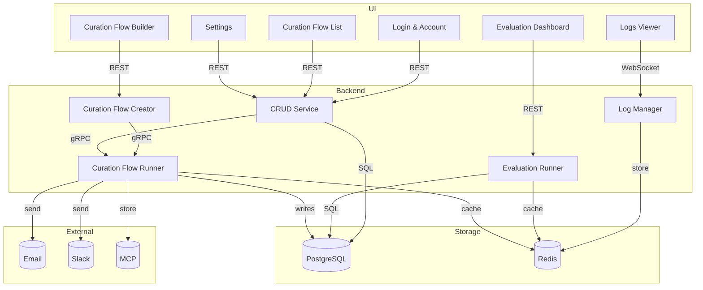

# Technical Design Template

## 1. Overview

### System Purpose

Curator AI is an AI-driven Personal Intelligence Platform that is designed to pull news, posts and feeds into a simple, customisable workflow engine. By using AI, we can filter, summarise and process information, drawing out the most meaningful insights and filtering out brainrot.

### Key Requirements

- Focused workflow engine, specifically for processing posts and feeds
- AI options for filtering and summarisation
- Workflow can be entirely built automatically using AI
- Email, Slack and MCP output options
- Operational with small, open weight LLMs
- Self-hostable
- Automatic Evalutiona Suite

### Success Criteria

- The user can provide a single URL plus an email address and the service will spin up an entire workflow for harvesting the data. If the site is a feed or contains news, this should work 100% of the time.
- The system can be 100% self hosted, with no external LLM infrastructure or APIs if the user doesn't want to

## 2. Architecture Overview

### High-Level Components

- UI
  - Login & Account Management  
  - Curation Flow List  
  - Curation Flow Builder (YAML editor + visual chain designer)  
  - Settings (models, SMTP, Slack, API keys)  
  - Logs Viewer (real-time tail + filters)  
  - Evaluation Dashboard (run comparison, score charts)
- Backend
  - CRUD
  - Curation Flow Creator
  - Curation Flow Runner
  - Evaluation Runner
  - Log Manager



## 3. Core Components

#### Curation Flow Engine

The Curation Flow Engine consists of the Parser, Execution Framework and the code for each Processor.

The Parser is designed to take in a Curator Document and convert it into an internal structure that includes the correct configuration for the Execution Framework, with the needed Processors attached. Once set up, the Curation Flow is set to be in Waiting state, until the required conditions for the Trigger is met, which will then start the loading from the Source and further process the data output it via the Output Processor.

**Responsibilities:**
- Accept a Curator Document
- Configure and stage a Curation run
- Execute a Curation run
- Handle requests to the LLM
- Send data to the User for most Outputs, store in cache for MCP

**Interfaces:**
- Input: Curator Document (see @./curator_doc_spec.yml), Runtime control (Start, Stop, etc)
- Output: Provides monitoring

#### Curation Flow Creator

The Curation Flow Creator is an AI-powered tool, designed to take a URL for a Website or Platform, and apply a number of Rule and AI-powered analysis to produce a Curator Document that curates the data from the website for the user.

**Responsibilities:**
- Accepts a URL initially, then lets the User specify other behaviour, like Quality metrics, Summarisation rules and required Outputs
- Outputs a valid Curator Document that successfully curates data from the site the user provided

#### Curation Flow Runner

**Purpose:** Orchestrate the execution of a single Curation Flow instance as a state machine.

**Responsibilities:**
- React to Trigger events or manual Run requests.
- Load Sources and execute the Processor chain in order.
- Coordinate LLM calls through the LLM Service.
- Persist intermediate Blocks for inspection and debugging.
- Publish status updates and final Output Blocks.

**Interfaces:**
- Input: RunRequest(id) via API / Trigger event from Scheduler.
- Output: RunStatus events over WebSocket, persisted Run records.

**Implementation Notes:**
- Worker-queue pattern using Redis Streams.
- Each run executes in its own goroutine with context tracing.
- Retry with exponential back-off per Processor.

#### CRUD Service

**Purpose:** Provide persistence and retrieval APIs for all domain entities (Users, Flows, Runs, Blocks, Logs).

**Responsibilities:**
- Expose REST endpoints for CRUD operations on primary entities.
- Enforce authentication and row-level authorization.
- Support pagination, filtering, soft delete, optimistic locking.
- Translate HTTP requests into service-layer commands and DB queries.

**Interfaces:**
- Input: HTTP JSON (REST) queries & mutations.
- Output: JSON responses, gRPC calls to internal services.

**Implementation Notes:**
- Go + Echo handlers → service layer → GORM (PostgreSQL).

#### Evaluation Runner

**Purpose:** Execute offline evaluations of stored Runs to measure quality and accuracy.

**Responsibilities:**
- Re-run saved Runs against evaluation prompts/criteria.
- Compute metrics (precision, accuracy, latency).
- Persist Evaluation Reports and surface them to the UI.

**Interfaces:**
- Input: EvalSpec referencing Run IDs (JSON).
- Output: EvalReport entities, Prometheus metrics, WebSocket progress events.

**Implementation Notes:**
- Triggered by cron or manual UI action.
- Results stored in PostgreSQL and visualised via UI.

#### Log Manager

**Purpose:** Centralised structured logging and error aggregation across services.

**Responsibilities:**
- Ingest logs from backend services and /api/v1/log/error endpoint.
- Correlate log entries by trace ID, flow ID, run ID.
- Provide search, filter and real-time tail capabilities to the UI.
- Enforce retention and archival policies.

**Interfaces:**
- Input: HTTP POST (frontend errors), gRPC/UDP stream from services.
- Output: Query API, WebSocket tail stream.

**Implementation Notes:**
- Stored in Redis
- Default retention 30 days (configurable).

#### Rule Engine

**Purpose:** Evaluate quality rule expressions against PostBlock data to filter content.

**Responsibilities:**
- Parse and compile rule expressions from Curator Documents.
- Evaluate expressions against Go structs (PostBlocks) safely and efficiently.
- Support field access, comparisons, logical operators, and array operations.
- Provide compile-time validation of rule syntax and type checking.

**Interfaces:**
- Input: Rule expression string and PostBlock data.
- Output: Boolean result (pass/drop decision).

**Implementation Notes:**
- Uses [expr](https://expr-lang.org) library for Go-native expression evaluation.
- Supports syntax: `comments.count > 5`, `score >= 100 && author != "[deleted]"`, `len(title.text) < 200`.
- Compile-time type checking against PostBlock struct definitions.
- Sandboxed execution with no side effects for security.

## 4. Data Models

### Primary Entities

```
Entity A {
  id: string
  field1: type
  field2: type
  relationships: []Entity
}

Entity B {
  id: string
  field1: type
  field2: type
}
```

### Data Relationships

- [Entity A] has many [Entity B]
- [Entity B] belongs to [Entity A]

## 5. Curator Documents

Curator AI's Curator Document is a YAML document providing a declarative document on where data is loaded from and how it is curated. The document is loosely temporal, with each individual Processor configured in each catagory being run one by one.

* Trigger Processors - Define when processing runs
* Source Processors - Fetch and ingest data
* Quality Processors - Filter and evaluate content
* Summary Processors - Transform and summarize content
* Output Processors - Deliver results

See @./planning/example_flow.yml for an example.

## 6. Block Design and Flow
To allow for abitrary data to effectively flow through the system without requiring bespoke schemas, a Source Processor's responsibility is to create a Block that fits the shape of one of the exiting block formats:

- PostBlock
  - Data and metadata of a Post
  - Everything needed to represent and operate on the Post

- CommentBlock
  - Data and metadata representing a Comment attached to a Post

- WebBlock
  - Data and metadata of a website
  - Can represent a URL attached to a post
  - May also contain the contents of the website for further processing

- ImageBlock
  - Data and metadata of an Image
  - Includes the URL of the image, if applicable
  - An Image might start life as only containing a URL parsed from another Block, before being loaded and the data populated later

See @./planning/block_design.md for specs of each Block.

### Block Flow

This example flow reproduces @./planning/example_flow.yml.

#### 1. Trigger
  - A scheduler (cron in the example) fires and asks the runner to start the flow.

#### 2. Source adapter → PostBlock creation
  - The Reddit adapter fetches a post and instantiates a PostBlock with only the raw data it can collect in one request:
    - id, url, basic metadata
    - empty placeholders for CommentBlock, WebBlocks, ImageBlocks, Summary, Quality.

#### 3. Enrichment processors (still under “sources”)
- If include_comments / include_web / include_images flags are true, the adapter also creates the corresponding child blocks (CommentBlock, WebBlock, ImageBlock) and attaches them to the PostBlock.
- At this point all blocks carry raw content but no quality/summarisation data.

#### 4. Quality stage
- Rule based processor (“min_comments”) runs first.
  - Reads comments.count; if it fails, the PostBlock is tagged Quality.result = drop and short-circuited.
- LLM quality processor (“is_relevant”) runs next on surviving blocks.
  - Sends the post text to an LLM, receives a relevance score / pass-drop decision.
  - Writes the structured result back into PostBlock.Quality.

#### 5. Summary stage
- Per-post summariser (“post_sum”) is executed.
  - Uses the prompt template and the interests param list.
  - Writes the returned summary into PostBlock.Summary.
- Any nested blocks (e.g. CommentBlock) may also be summarised if configured.

#### 6. Run-level summariser
- After every post has finished its own processors, the flow-level LLM (“full_sum”) creates an aggregate summary across all surviving PostBlocks.
- Output stored separately (not inside each PostBlock).

#### 7. Output stage
- Email processor turns each surviving PostBlock plus the run summary into the final HTML email using emailTemplate.
- Marks PostBlock as “delivered” (implementation detail: often a status flag or timestamp).

## 5. API Design

### CRUD Service

### Auth
- POST /api/v1/auth/login
- POST /api/v1/auth/refresh
- POST /api/v1/auth/logout
- GET  /api/v1/auth/me

#### Curator Documents
- GET  /api/v1/flows
- POST /api/v1/flows
- GET  /api/v1/flows/{id}
- PUT  /api/v1/flows/{id}
- DELETE /api/v1/flows/{id}

#### Blocks
- GET /api/v1/blocks?runId= – list blocks for a run
- GET /api/v1/blocks/{id} – fetch single block (+type-specific fields)

#### Curation Flow Creator (Backend → FlowCreator)
- POST /api/v1/flow-creator/derive – body: { url, email } → returns draft Curator Document
- POST /api/v1/flow-creator/validate – validate a supplied YAML/JSON Curator Document

### Curation Flow Runner (Backend → FlowRunner)
#### Execution control

- POST /api/v1/flows/{id}/runs – manual trigger
- POST /api/v1/runs/{id}/cancel – cancel in-flight run

#### Run inspection
- GET  /api/v1/runs – filter by flow / status / date
- GET  /api/v1/runs/{id} – run metadata & stats
- GET  /api/v1/runs/{id}/summary – aggregate “full_sum” output

#### Live status (WebSocket)
- WS   /api/v1/runs/{id}/events – stream RunStatus updates

### Evaluation Runner (Backend → EvalRunner)
- POST /api/v1/evaluations – body: EvalSpec
- GET  /api/v1/evaluations/{id} – report
- GET  /api/v1/evaluations – list / filter
- WS   /api/v1/evaluations/{id}/events – progress stream

### Log Manager (Backend → LogManager)
#### Ingest

- POST /api/v1/log/error – front-end error logging (already noted)
- POST /api/v1/log – structured service log batch

#### Query / tail
- GET  /api/v1/logs – search / filter
- WS   /api/v1/logs/stream – real-time tail (supports query params)

### System Settings
- GET  /api/v1/settings – current config (mask secrets)
- PUT  /api/v1/settings – update SMTP, Slack, model paths, etc.

### Health & Metrics
- GET /healthcheck

## 6. Technology Stack

### Core Technologies

#### Front End

- **Language:** Typescript
- **Framework:** NextJS

#### Back End

- **Language:** Go
- **Framework:** Echo
- **Database:** PostgreSQL
- **Cache:** Redis

### Infrastructure

- **Deployment:** Docker Compose
- **Hosting:** Self-Hosted
- **Monitoring:** Internal Monitoring Dashboard

## 7. Security Considerations

### Authentication & Authorization

- **Auth mechanism**: JWT (JSON Web Tokens) with middleware-based validation
  - Alternative: Session-based auth with secure cookies
  - OAuth 2.0/OpenID Connect for third-party integration
  - API keys for service-to-service communication
  - github.com/golang-jwt/jwt/v5
- **Permission model**:
  - Resource + User-level permissions with middleware guards

## 8. Error Handling & Monitoring

### Error Handling Strategy

- **Error Classification:**

  - System Errors: Database failures, network timeouts, service unavailability
  - LLM Errors: Model failures, rate limits, malformed responses, timeout errors
  - Data Errors: Invalid feeds, parsing failures, malformed content
  - User Errors: Invalid configurations, authentication failures
  - Workflow Errors: Step failures, dependency issues, validation errors
- **Error Response Format:**

  - Structured JSON with error code, message, context, and correlation ID
  - Stack traces captured for system errors (development/debug mode)
  - User-friendly messages for client-facing errors
- **Retry Mechanisms:**

  - Exponential backoff for LLM requests with configurable max attempts
  - Circuit breaker pattern for external service calls
  - Immediate retry for transient network errors

### Monitoring & Observability

- **Metrics:**
  - LLM-specific metrics for evaluation engine
- **Logging:**
  - Runtime Logs: Each step in the flow should produce logs of each activity, including data. Full data logs are stored for the most recent run.
  - Evaluation Logs: Evaluation Logs are used for validating the quality of LLM outputs. The data should be both input to the LLM, and the output from it
  - Error Logs: Front end is captured from the /log/error endpoint, while backend is captured and stored.

## 9. Testing Strategy

### Test Levels

- **Unit Tests:** Standard Unit Tests, Front and Backend.
- **Integration Tests:** Use integration tests where appropriate.
- **End-to-End Tests:** For critical user journeys.

### Test Data Management

- Avoid any testing with real LLMs, always mock data

## 11. Deployment & Operations

### Deployment Strategy

- Use Docker Compose with Docker images available on GitHub Container Registry

### Configuration Management

- Environment Variables or .env config only
